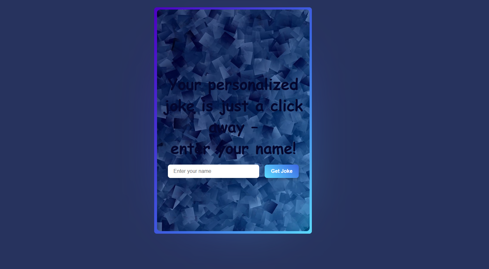
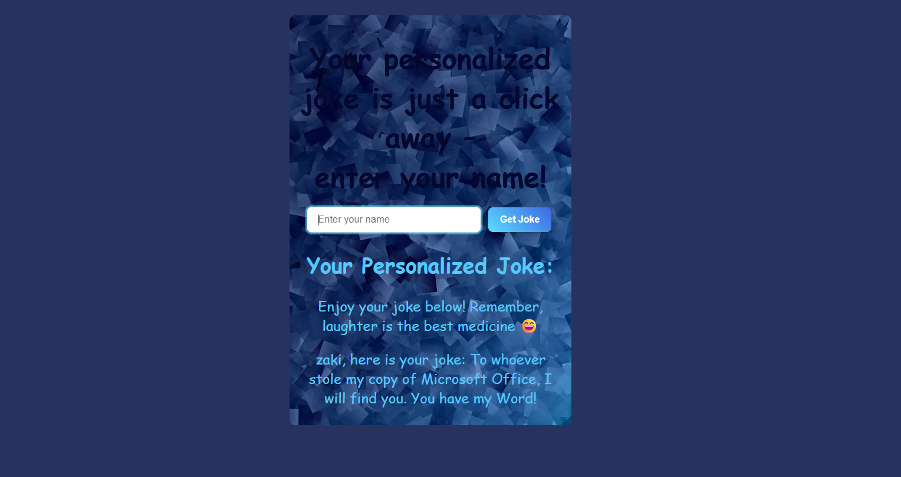

# 😂 Joke Generator App


A fun web application that generates **random jokes** using the [JokeAPI](https://v2.jokeapi.dev/). Built with Node.js and Express, the app fetches jokes from an external API and renders them dynamically with EJS.

---

## ✨ Features

- 😄 Random joke generation
- 🔒 Safe mode enabled (no inappropriate content)
- 🌐 External API integration with Axios
- ⚡ Dynamic rendering with EJS

---

## 🛠️ Tech Stack

| Technology | Usage |
|------------|-------|
| Node.js | Runtime |
| Express.js | Web framework |
| Axios | HTTP requests to JokeAPI |
| EJS | Templating engine |

---

## 🌐 API Used

[JokeAPI v2](https://v2.jokeapi.dev/) — Free public API for jokes.

Endpoint used:
```
GET https://v2.jokeapi.dev/joke/Any?safe-mode
```

---

## 🚀 Getting Started

### 1. Clone the repository

```bash
git clone https://github.com/ton-username/joke-generator.git
cd joke-generator
```

### 2. Install dependencies

```bash
npm install
```

### 3. Run the app

```bash
node index.js
```

App running at: **http://localhost:3000**

---

## 📁 Project Structure

```
├── public/
├── views/
│   └── index.ejs
├── .gitignore
├── index.js
├── package.json
└── package-lock.json
```

---

## 📄 License

This project is open source and available under the [MIT License](LICENSE).

## 📸 Screenshot




